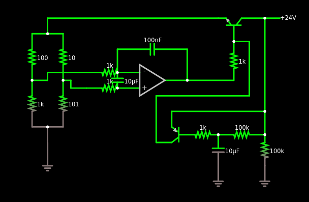
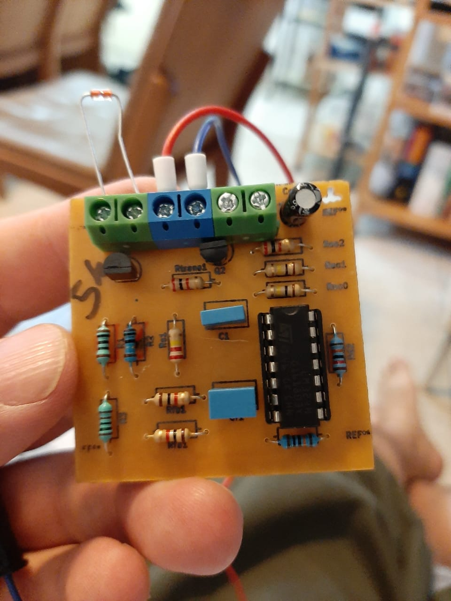

# Project of a thermistor based constant temperature anemometer

This repository contains files related to a constant temperature anemometer that uses a self heated NTC thermistor as a sensing element.

## Thermal anemometer

An anemometer is a device that measures fluid speed, in particular air. A thermal anemometer uses heat transfer from a heated element to estimate the velocity of the fluid. There are several ways to build a thermal anemometer but the most common is the use of a self heated resistor whose resistance varies with temperature.

As a side note, a few years ago, José Pucci Caly, a professor at Mackenzie University in São Paulo/Brazil developed with a couple of students a very simple anemometer: the external temperature of the bulb from an incandescent light bulb was calibrated against wind speed. It worked. How well? I don't remember...

There are several ways that a self heated resistor can be used as the two mosto common aproaches are:

 * Constant temperature
 * Constant current

In this project we use the constant temperature approach.

## CTA - Constant temperature anemometer

The basic idea behind the constant temperature anemometer (CTA) is that an electric current passing through a resistor will heat the resistor. The temperature of the resistor is the result of the heat transfer to the fluid flowing around it.

Now suppose that for a given fluid velocity the temperature of the resistor is Tw. If the velocity then increases a tiny bit, Tw should drop a little bit. This drop in temperature corresponds to a change in resistance (when the resistance depends on the temperature). This change in resistance can be picked up and the current flowing through the resistor is changed accordingly.

The figure below shows the basic idea behind the anemometer. In this figure, Rw is the sensor. An imbalance of the Wheatsone bridge will cause a change of the current on the feedback loop. While this basic layout explains in general terms what is being done, it doesn't work. For one, most op amps can not provide sufficient current to the bridge. But there are other issues with this simple scheme.

This project uses an NTC thermistor (<https://en.wikipedia.org/wiki/Thermistor>) as a sensing element. In this case, an increase in temperature results in a decrease of resistance. This change can be drastic. For instance for a thermistor with a resistance of 5k at 25oC, at 180oC, the resistance can be 100 Ohms.

## Understanding the circuit

If the flow spead increases, the temperature will decrease and therefore the thermistor's resistance wqill increase and the voltage just before the sensor will increase and that will increase the output from the op amp so that it restores balance. To handle larger currents, the output of the op amp is connected to the base of an NPN transistor.

Even with the transistor in place, the circuit will not work. How does it start? When the power is turned on, there is no current on the bridge and therefore no imbalance and the base current is zero. So the circuit stays off indefinitely.

One possible solution is to nudge the + input of the op amp by connecting it to input voltage using a large resistor. This will work but now we have a problem: the operating point of the circuit will depend on the input voltage. This is not good. The figure below shows the basic circuit used:

This figure was generated from the text file  `cta-circuit.txt` using the online Falstad circuit simulator (<https://www.falstad.com/circuit/circuitjs.html>). Go to the previous link, select File -> Import from text and copy and paste the contents of the `cta-circuit.txt` file.

This is the completed circuit. The sub-circuit on the lower right hand side of the circuit basically unbalances the + input of op amp during power up so that the circuit is started. When the 10uF capacitor is charged, the PNP transistor is switched off and this branch of the circuit plays no role anymore.

There is now an input filter at the op amp. Without the feedback capacitor, once the bridge reached equilibrium, the current would be cutoff. The 100nF capacitor works as a integral controller.

The output of the anemometer is the voltage feeding the sensor. This output is fed to a voltage follower and then to a voltage divider to lower the voltage to levels adequate to an analog to digital converter and then there is another voltage follower to isolate the output.

This circuit uses 3 op amps and the LM324 quad 
## KiCad schematics

On the `kicad` folder is the KiCad project of the circuit.

## The finished board

